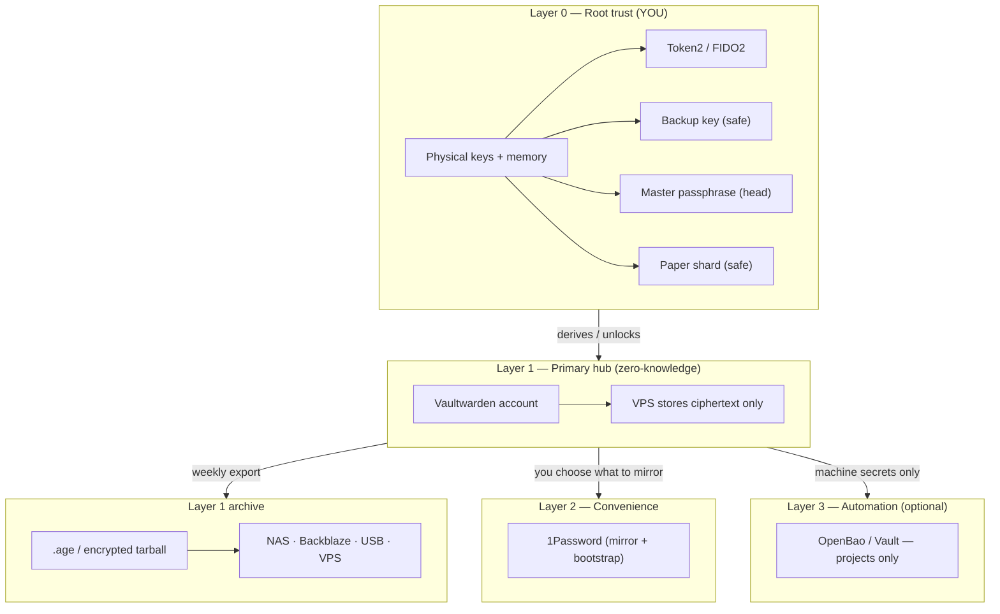
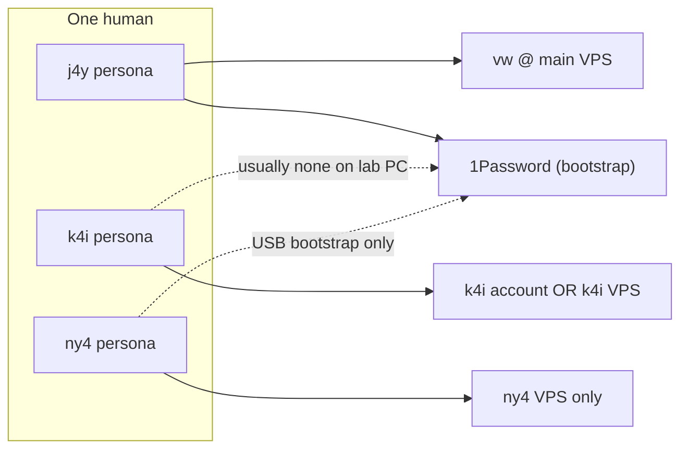
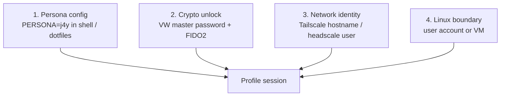
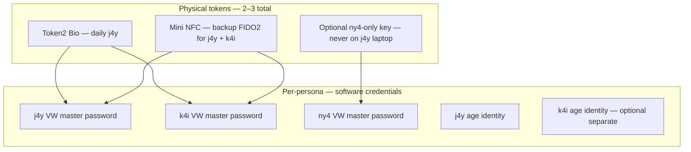
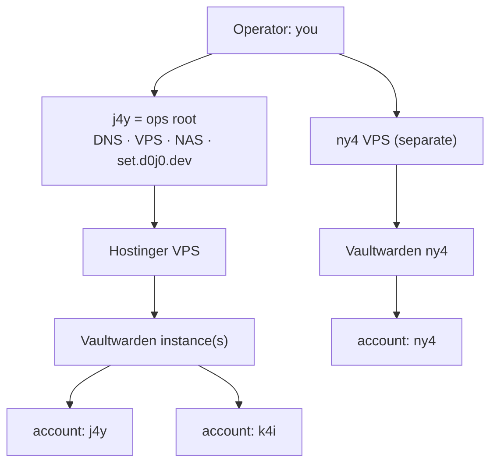
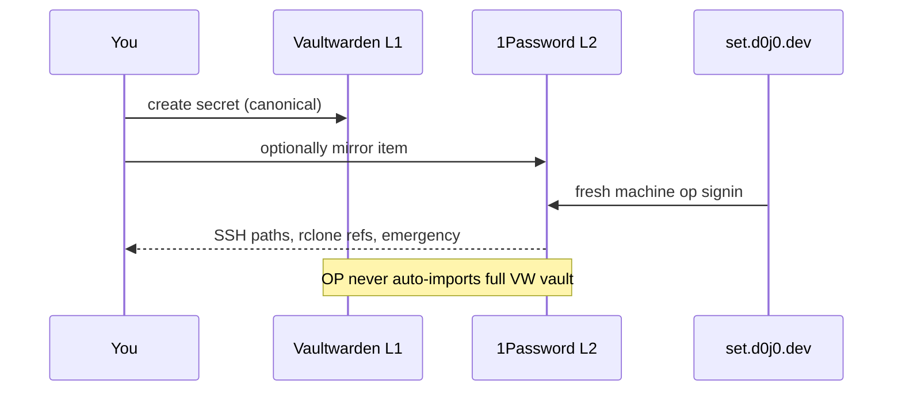
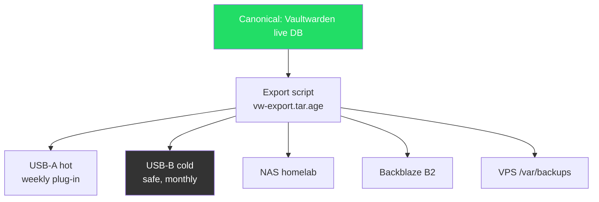

# Trust architecture — layers, personas, backups

> Visual reference for the j4y / k4i / ny4 persona model.
> Open in Cursor/GitHub preview for Mermaid diagrams.
> Export: paste diagrams into [mermaid.live](https://mermaid.live) → SVG/PNG for Excalidraw.

---

## One picture — layer map (per persona)

Each **persona** gets the same *shape* of layers. What changes is **how strong** each layer is and **which machines** may touch it.



### Trust rule (canonical)

1. **New secrets → Vaultwarden first** (Layer 1).
2. **1Password gets only what you choose to mirror** (Layer 2).
3. **VPS / Backblaze / NAS never see plaintext** — ciphertext and public configs only.
4. **OpenBao is not for personal passwords** — automation layer only.

---

## Three personas — not three humans

| Persona | Role | Machine trust | Mobile | Typical use |
|---------|------|---------------|--------|-------------|
| **j4y** | Primary life | Trusted laptop, NAS, main Arch | Yes | Real accounts, homelab, daily work |
| **k4i** | Lab / explore | **Untrusted** or semi-trusted PC | Optional / minimal | THM, CTFs, free-tier signups, experiments |
| **ny4** | Isolated | Dedicated box or custom tail OS | **No** | High separation, different VPS, “life without phone” |

**Key insight:** personas are **compartmentalization**, not separate people. You still have one brain; you split **keys, vaults, networks, and dotfiles** so a compromise in k4i does not drag j4y with it.



---

## How the computer knows “which profile is active”

Identity is **not one switch** — it is four axes that must agree:



| Axis | j4y example | k4i example | ny4 example |
|------|-------------|-------------|-------------|
| Config | `~/.config/persona/j4y.env` | `k4i.env` — different git email, BW URL | `ny4.env` — minimal |
| Crypto | VW account `j4y@…` + Token2 | VW account `k4i@…` + same or separate key | VW on other VPS, own key |
| Network | `j4y-laptop` on tailnet | **No** j4y tailnet routes; maybe separate tag | Own tailnet / no tail |
| Boundary | Normal user `j4y` | QEMU VM or user `k4i` on lab machine | Dedicated machine |

**Recommended:** `persona` command (future) sets env + shows banner:

```bash
persona j4y   # BW_SERVER, OP_ACCOUNT, git identity, trustlay
persona k4i   # different BW, no op, firejail/vm hint
persona ny4   # offline-first flags
```

---

## Keys: you do NOT need 12 hardware keys

Bad model: `3 personas × (bio + mini + backup + safe copy) = 12 keys` ❌

Good model: **keys are for tiers, personas use different credentials on the same keys**



| Item | Count | Notes |
|------|-------|-------|
| Token2 Bio | 1 | j4y daily; can enroll **separate FIDO2 creds** per persona/site |
| Backup FIDO2 mini | 1 | Register as backup 2FA on same accounts |
| ny4-only key | 0–1 | Only if ny4 must never share hardware with j4y |
| VW master passwords | 3 | **Software** — different passphrase per persona |
| age identities | 1–3 | j4y required; k4i/ny4 if you want separate archive keys |
| Paper in safe | 1–2 sheets | **Shards**, not full secrets |

**FIDO2** proves “someone with this key.” **Master password** derives the vault encryption key. They are different jobs.

---

## Vaultwarden: one server or three?

| Strategy | When | j4y | k4i | ny4 |
|----------|------|-----|-----|-----|
| **A. One VW, multiple accounts** | Default start | account on `vw.d0j0.dev` | second account, same host | third account OR skip |
| **B. Two VW instances** | k4i compromised server fear | main VPS | same VPS, different subdomain + DB | — |
| **C. ny4 on own VPS** | Maximum isolation | `vw.d0j0.dev` | shares A or B | `vw-ny4.other.tld` |

**Recommendation**

- **Start with A:** one Vaultwarden, three Bitwarden **accounts** (different emails/aliases, different master passwords). Cryptographically isolated vaults; one ops burden.
- **Move k4i to B** if lab activity is noisy — still one VPS, separate instance/firewall.
- **ny4 always C** — different VPS, different tailnet, no shared admin.

There is **no “admin persona”** for your secrets. You are the admin. **j4y** is the **operational root** (bootstrap, NAS, 1Password, main VPS). k4i and ny4 are **restricted compartments**, not lesser admins.



---

## age vs GPG vs PQC

| Tool | Use here? | Why |
|------|-----------|-----|
| **Vaultwarden crypto** | Layer 1 live vault | Audited Bitwarden model (AES + Argon2id). Do not roll your own. |
| **age** | Layer 1 **archives** | Simple, modern, you already use Token2 plugin. Fewer footguns than PGP. |
| **GPG** | Optional | Huge ecosystem, smartcard PGP on YubiKey; steeper curve. Use if you already live in gpg. |
| **DIY PQC** | **No for now** | Wait for upstream (age, TLS, Bitwarden). |

### Quantum (honest version)

- **Symmetric** 256-bit (AES-256, XChaCha20) — considered **PQ-safe** for bulk data at rest.
- **Weak spot** is usually **public-key** (ECC, RSA) — TLS, FIDO2, key exchange. Industry is moving to **hybrid classical+PQC**.
- Your **encrypted `.age` backups** with symmetric passkeys / hardware-derived secrets are already in good shape for long-term archive.
- **Action:** use current tools; re-encrypt archives when age/Bitwarden ship stable PQ-hybrid modes.

---

## 1Password as Layer 2 — what it gets from where

1Password is **not** the source of truth anymore. It is **bootstrap + mirror + sharing**.



**Bootstrap chain (j4y machine from scratch)**

1. `curl -fsSL https://set.d0j0.dev | bash` — public, no secrets
2. `op signin` — **one** human step; 1Password holds **pointers**
3. Scripts pull SSH, rclone, dotfiles
4. You log into **Vaultwarden** separately — master password + FIDO2
5. New secrets go to VW; only chosen items copied to OP

**k4i on untrusted machine:** skip 1Password entirely. VW web/app + persona dotfiles only.

**ny4:** bootstrap from **USB** (`ny4-bootstrap.age`) — no `set.d0j0.dev`, no j4y OP.

---

## Backup topology — 5 places (all ciphertext)



| Location | Role | Frequency | Contents |
|----------|------|-----------|----------|
| **USB-A (hot)** | Fast recovery | Weekly | `*.age`, persona configs, dotfiles bundle |
| **USB-B (cold)** | Fire/theft | Monthly | Same, older snapshot |
| **NAS** | Homelab copy | Weekly cron | `*.age` + restic optional |
| **Backblaze** | Offsite | Weekly | **`.age` only** — never plaintext |
| **VPS** | Convenience | Weekly | `*.age` only — dumb storage |

**Rule:** same encrypted blob to every location. One encrypt, many copies. Decrypt only with Layer 0.

---

## Persona cheat sheet

### j4y (primary)

- VW: `vw.d0j0.dev` — full mobile + desktop clients
- 1Password: yes — bootstrap + selective mirror
- Token2: daily
- Tailscale/Headscale: full mesh
- Backup: all 5 locations
- Bootstrap: `set.d0j0.dev`

### k4i (lab / untrusted)

- VW: account on main VW **or** isolated instance; **no OP on machine**
- 1Password: **not installed** on lab PC (or separate OP account you never use for j4y)
- Token2: backup key only, or dedicated k4i FIDO cred on same key
- Network: separate tailscale identity or no tail; no j4y NAS mounts
- Backup: VW export only; skip j4y USB paths
- Bootstrap: minimal script / VM image; THM-only email in VW

### ny4 (isolated / no mobile)

- VW: **separate VPS**
- 1Password: optional emergency doc only
- Token2: optional third key that never touched j4y hardware
- Network: own tailnet or offline
- Backup: USB-B + separate B2 bucket
- Bootstrap: USB-only; custom Arch / Tail image

---

## What to build next (implementation order)

1. **Deploy Vaultwarden** on Hostinger (`vw.d0j0.dev`) — j4y account first
2. **`persona` env files** in `homelab-dotfiles/personas/{j4y,k4i,ny4}.env`
3. **`vw-backup` script** → `tar.age` → NAS + B2 + VPS + USB rsync
4. **Second VW account** for k4i; test on QEMU VM
5. **ny4** — separate VPS when ready
6. **`trustlay personas`** in shell — prints this map in terminal

---

## Study list

1. Bitwarden security whitepaper — how Layer 1 E2E works
2. [age-encryption.org](https://age-encryption.org) — archive layer
3. Compartmentalization / “identity segmentation” (THM SecOps mindset)
4. NIST SP 800-208 — PQC overview (when curious, not urgent)
5. 3-2-1 backup rule variants

---

## Quick answers

| Question | Answer |
|----------|--------|
| 12 keys? | **No** — 2–3 physical tokens, 3 master passwords |
| One profile = whole layer map? | **Yes** — same layers, different strength per persona |
| Separate VW per profile? | **j4y+k4i:** one server OK; **ny4:** own VPS |
| Who is root admin? | **You.** j4y is ops root, not crypto root over ny4 |
| age or gpg? | **age** for archives; VW handles live vault |
| PQC now? | Symmetric backups OK; watch upstream for PQ-hybrid |
| 1Password source? | Bootstrap pointers only; VW is canonical for secrets |
